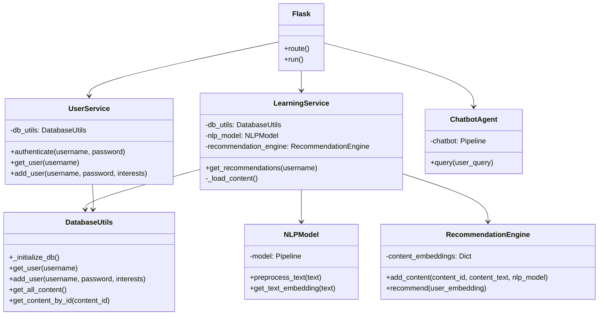

# Personalized Learning Platform - Technical Documentation

## Table of Contents
1. [System Overview](#system-overview)
2. [Architecture](#architecture)
3. [Class Diagram](#class-diagram)
4. [Component Details](#component-details)
5. [Service Layer](#service-layer)
6. [Model Layer](#model-layer)
7. [API Layer](#api-layer)
8. [Database Layer](#database-layer)
9. [Configuration](#configuration)
10. [Deployment](#deployment)

## System Overview

The Personalized Learning Platform is a Flask-based web application that provides personalized learning content recommendations and an interactive chatbot. The system leverages Natural Language Processing (NLP) techniques and recommendation algorithms to deliver tailored content to users based on their interests.

### Key Features
- User authentication and profile management
- Personalized content recommendations using NLP
- Interactive AI-powered chatbot using T5 model
- User dashboard with dynamic recommendations
- Interest-based learning paths

## Architecture

The application follows a layered architecture pattern with clear separation of concerns:

```
personalized-learning-platform/
├── app.py                 # Main application entry point and API routes
├── models/               # Domain models and ML components
│   ├── chatbot_agent.py  # T5-based chatbot implementation
│   ├── nlp_model.py      # Text processing and embeddings
│   └── recommendation.py # Content recommendation engine
├── services/            # Business logic and orchestration
│   ├── user_service.py   # User management and authentication
│   └── learning_service.py # Content and recommendation management
├── utils/              # Utility functions and helpers
│   └── database_utils.py # Database operations
├── templates/           # HTML templates for web interface
├── config/             # Configuration files
└── data/              # Data storage and resources
```

## Class Diagram



## Component Details

### Service Layer Classes

#### UserService
**Purpose**: Manages user authentication and profile operations
**Dependencies**: DatabaseUtils
**Key Methods**:
- `authenticate(username, password)`: Validates user credentials
- `get_user(username)`: Retrieves user profile
- `add_user(username, password, interests)`: Creates new user accounts

#### LearningService
**Purpose**: Orchestrates content recommendations and learning paths
**Dependencies**: DatabaseUtils, NLPModel, RecommendationEngine
**Key Methods**:
- `get_recommendations(username)`: Generates personalized content recommendations
- `_load_content()`: Initializes content in recommendation engine

### Model Layer Classes

#### ChatbotAgent
**Purpose**: Provides conversational AI capabilities
**Dependencies**: Hugging Face T5 model
**Key Methods**:
- `query(user_query)`: Processes user questions and generates responses

#### NLPModel
**Purpose**: Handles text processing and embedding generation
**Dependencies**: Hugging Face DistilBERT model
**Key Methods**:
- `preprocess_text(text)`: Cleans and normalizes text input
- `get_text_embedding(text)`: Generates vector embeddings for text

#### RecommendationEngine
**Purpose**: Implements content recommendation algorithms
**Dependencies**: scikit-learn
**Key Methods**:
- `add_content(content_id, content_text, nlp_model)`: Indexes new content
- `recommend(user_embedding)`: Generates recommendations using cosine similarity

## Service Layer Interactions

### Authentication Flow
1. User submits credentials via Flask route
2. UserService.authenticate validates credentials
3. Flask session stores authenticated user
4. Subsequent requests check session state

### Recommendation Flow
1. User accesses dashboard
2. LearningService retrieves user profile
3. NLPModel generates embeddings for user interests
4. RecommendationEngine compares with content embeddings
5. Sorted recommendations returned to user

## API Layer

### REST Endpoints
All routes are defined in `app.py`:

#### Authentication Routes
```python
@app.route("/", methods=["GET", "POST"])
@app.route("/register", methods=["GET", "POST"])
@app.route("/logout")
```

#### Feature Routes
```python
@app.route("/dashboard")
@app.route("/chat", methods=["POST"])
```

## Database Layer

### Schema Design
The application uses SQLite with the following schema:

#### Users Table
```sql
CREATE TABLE users (
    username TEXT PRIMARY KEY,
    password TEXT,
    interests TEXT
)
```

#### Content Table
```sql
CREATE TABLE content (
    id TEXT PRIMARY KEY,
    description TEXT
)
```

## Configuration

### Environment Variables
Required environment variables:
```bash
SECRET_KEY=<flask-session-key>
DATABASE_PATH=<path-to-sqlite-db>
```

### Model Configuration
- Chatbot: google/flan-t5-large
- Embeddings: distilbert-base-uncased

## Deployment

### Prerequisites
- Python 3.10+
- pip or pipenv
- Required packages in requirements.txt

### Production Setup
1. Clone repository
2. Install dependencies
3. Configure environment variables
4. Initialize database
5. Deploy with production WSGI server

### Security Measures
- Password hashing (TODO: implement bcrypt)
- Session management
- Input validation
- CSRF protection
- Rate limiting

## Future Enhancements

### Planned Features
1. External content provider integration
2. Advanced recommendation algorithms
   - Collaborative filtering
   - Deep learning models
3. Enhanced chatbot capabilities
   - Context awareness
   - Multi-turn conversations
4. Mobile application
5. Real-time progress tracking
6. Social learning features

### Technical Improvements
1. Implement proper password hashing
2. Add comprehensive test suite
3. Set up CI/CD pipeline
4. Add performance monitoring
5. Implement caching layer 